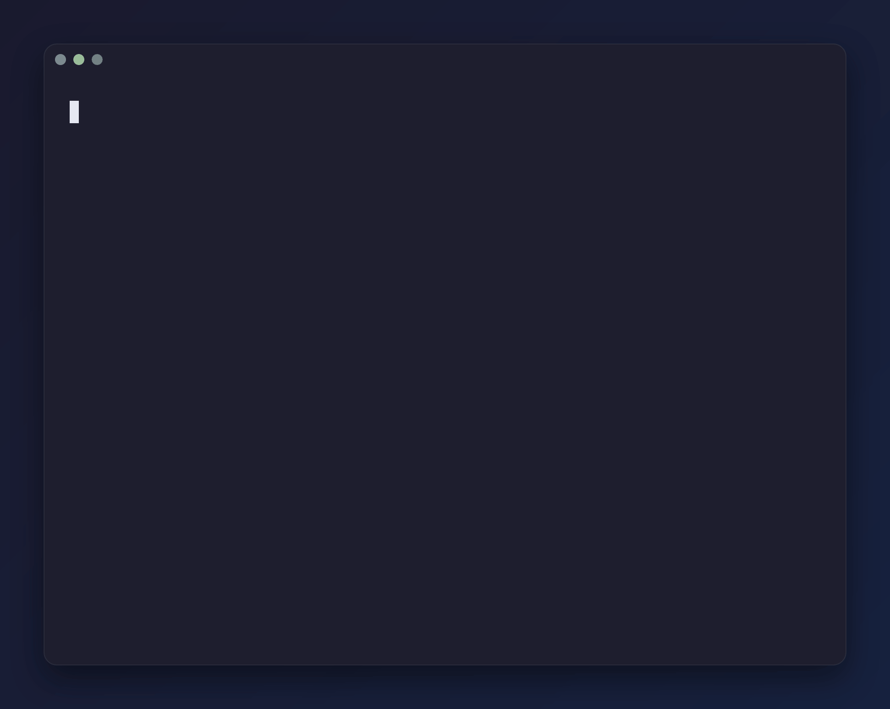
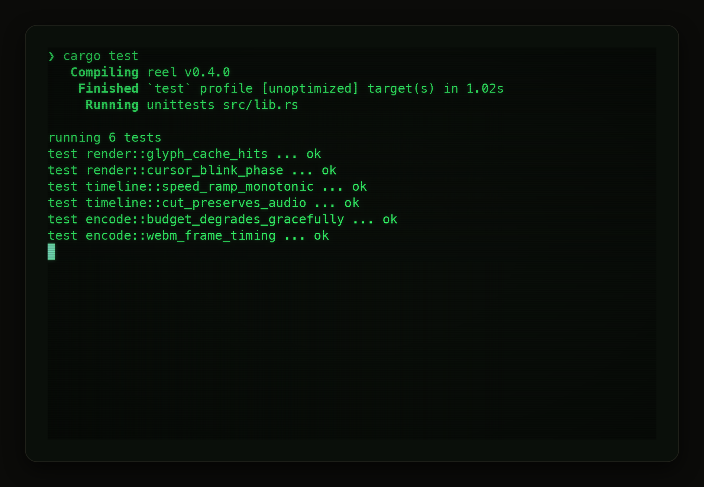
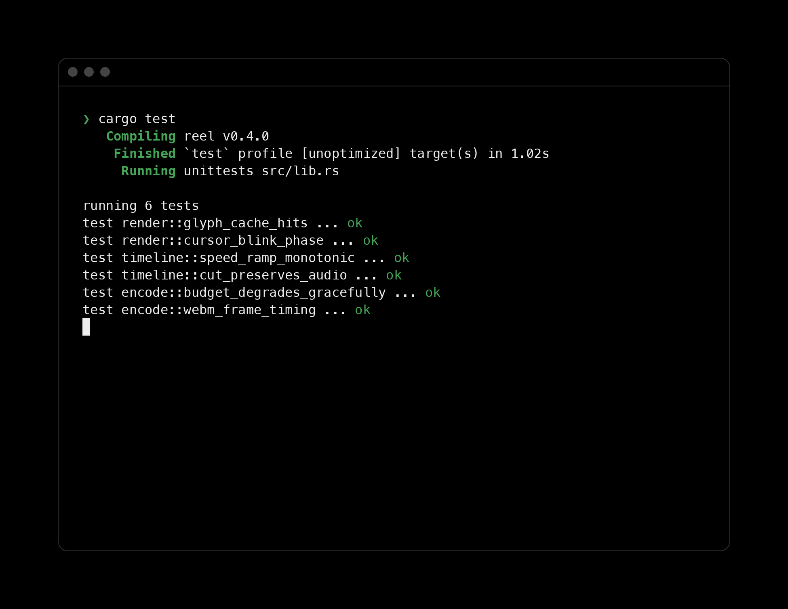
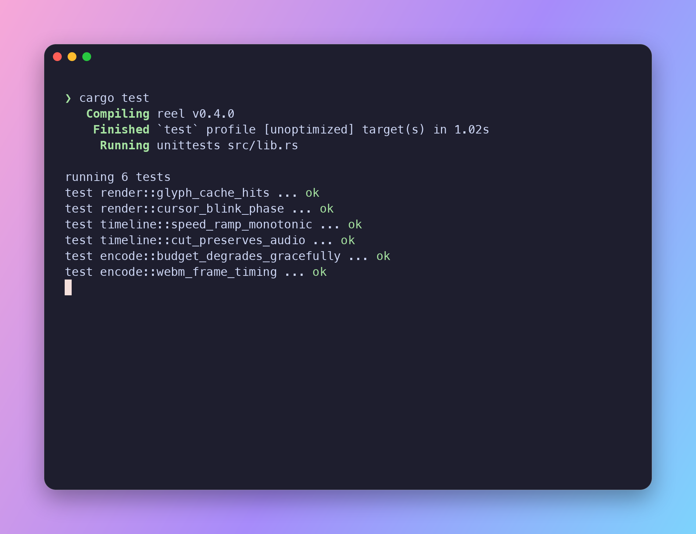
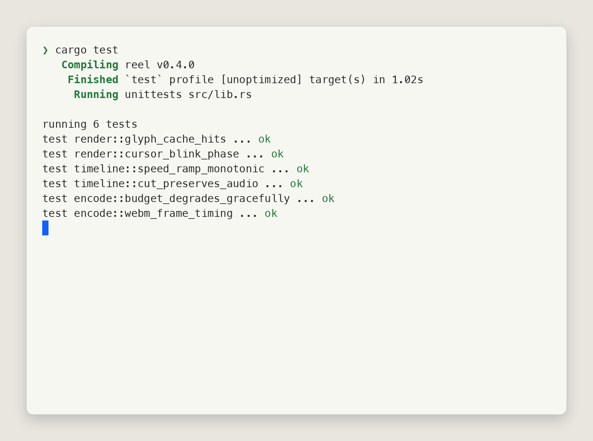

<p align="center">
  
</p>

<h1 align="center">reel</h1>

<p align="center"><em>Your terminal demo, edited like video.</em></p>

<p align="center">
  <a href="https://github.com/galfrevn/reel/actions/workflows/ci.yml"></a>
  <a href="https://galfrevn.github.io/reel/"></a>
  <a href="LICENSE"></a>
</p>

Record a terminal session once, then treat it as a timeline you can cut,
speed-ramp, zoom, caption, restyle, and score with sound — re-rendering in
milliseconds without ever re-running the underlying program.

<p align="center">
  
</p>

<p align="center"><sub>This GIF was cut, sped up, zoomed, captioned, and rendered by reel itself
— from <a href="documentation/assets/hero.reel">six lines of edit script</a>.</sub></p>

## Install

reel is built to be driven by a coding agent. Add the skill and that's the
whole setup — the agent installs the binary on first use, then records,
edits, and renders for you:

```sh
npx skills add galfrevn/reel
```

Works anywhere [agent skills](skills/reel/SKILL.md) do (Claude Code, Cursor,
…). Ask for the outcome rather than the steps —

> *"record a demo of my CLI and make me a README GIF under 800kb with the
> boring install part sped up"*

— and the agent handles the recording setup, the inspection, the `.reel`
edit script, the render, and the size budget. You only perform the live
session and judge the result.

<details>
<summary><strong>Or install it by hand</strong></summary>

```sh
curl -fsSL https://raw.githubusercontent.com/galfrevn/reel/main/setup.sh | bash
```

Grabs a prebuilt binary when one exists for your platform, otherwise builds
from source with cargo. One binary — no `ttyd`, no `ffmpeg`. Prefer to skip
the script? Download the tarball for your platform straight from
[releases](https://github.com/galfrevn/reel/releases/latest) and drop `reel`
somewhere on your `PATH`.

</details>

## Quick start

```sh
# Record with reel's own capture (asciinema .cast files work too)
reel record -o session.cast -- your-tui

# Instant render with default styling
reel render session.cast

# Or scaffold an edit file and shape the timeline
reel init glass
reel render demo.reel
```

A `.reel` file is TOML front-matter plus a newline-delimited edit script:

```
---
[source]
cast = "session.cast"

[template]
name = "glass"

[output]
file   = "demo.webm"
budget = "2mb"          # the encoder degrades predictably to fit

[audio]
keyboard = "mx-brown"   # procedural keystrokes from the recorded input
---

trim    2s..end
cut     19s..23s                  # remove the typo
speed   5x from 8s to 34s         # compress the model's thinking pause
caption "Refactor the auth module" at 4s for 2.5s
zoom    1.8x at (30,10) from 36s to 41s
sound   "success" at 41s
freeze  last 1.5s
```

Because edits apply to a frozen recording, iterating costs nothing:
`reel watch` re-renders on every save, and timestamps always refer to the
source clock, so a `caption` stays glued to its moment even after you `cut`
footage before it.

## What you get

- **Timeline editing** — `trim`, `cut`, `speed`, `zoom`, `caption`,
  `highlight`, `freeze`… Press `Ctrl+]` while recording to drop markers,
  then edit by name: `cut @1..@2`.
- **Keystroke overlay** — `keys on` shows what you typed as screenkey-style
  chips, straight from the recorded input; `redact "pattern"` masks secrets
  before they ship (renders warn about emails/tokens they spot).
- **Templates that look designed** — `glass`, `minimal`, `classic`, `geist`,
  `paper`, `crt`, `aurora` built in; bring your own as TOML or install packs
  from GitHub. Themes import from base16, Alacritty, and iTerm2.
- **Size budgets** — `budget = "800kb"` and the encoder walks a predictable
  degradation ladder, reporting every step.
- **Sound without audio files** — keystrokes, UI cues, and agent-thinking
  beds synthesized procedurally into WebM/Opus; `speed 5x` drops key sounds
  instead of chipmunking them.
- **GIF, WebM, APNG, PNG** — routed by the output extension; `reel shot`
  grabs a single styled frame for screenshots.

## The same recording, in every look

Templates are the complete visual identity — window chrome, wallpaper,
shadows, prompt, even motion. These four frames come from the same cast:

| | |
|:---:|:---:|
|  `crt` |  `vercel` |
|  `candy` |  `paper` |

Browse **every template as a live preview** in the
[community gallery](https://galfrevn.github.io/reel/), then:

```sh
reel template search neon          # find looks published by others
reel template try owner/repo/name  # preview against a bundled demo, no install
reel template add owner/repo/name  # keep it
```

Publishing your own is a [PR with a TOML file](registry/README.md) — no
accounts, no infrastructure. Sounds work the same way: `reel audio search`,
`reel audio try`, `reel audio publish`.

## Documentation

| Doc | What's in it |
|---|---|
| [skills/reel/SKILL.md](skills/reel/SKILL.md) | The agent skill: how an agent installs, records, edits, and renders |
| [documentation/idea.md](documentation/idea.md) | What reel is, why it exists, and what it deliberately isn't |
| [documentation/setup.md](documentation/setup.md) | Full user guide: install, recording, the `.reel` format, templates, audio, agent skill |
| [documentation/development.md](documentation/development.md) | Building from source, workspace layout, tests, CI |
| [documentation/roadmap.md](documentation/roadmap.md) | What's next: script mode, kitty/sixel graphics, `.tape` import, formats |

## License

MIT.
