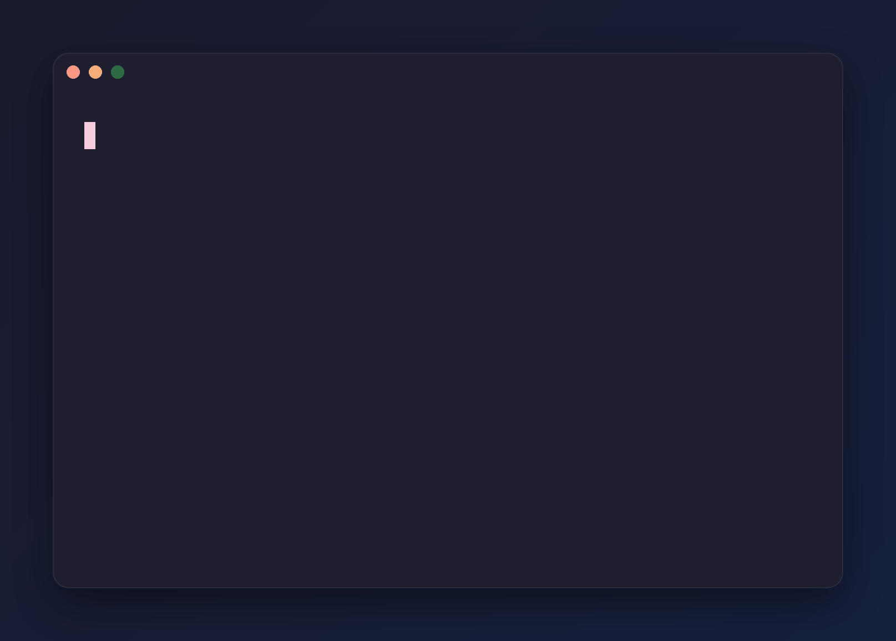
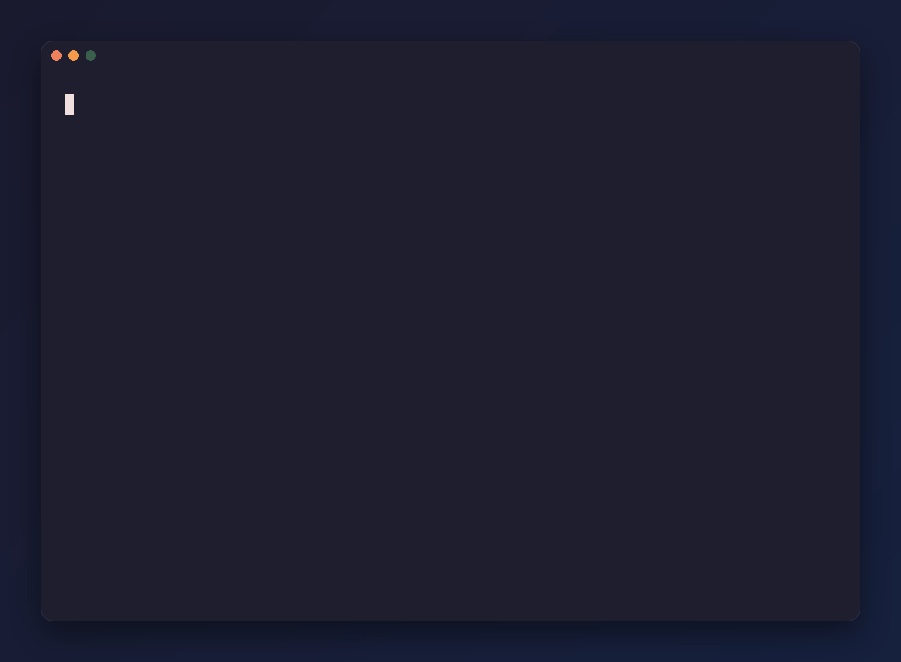
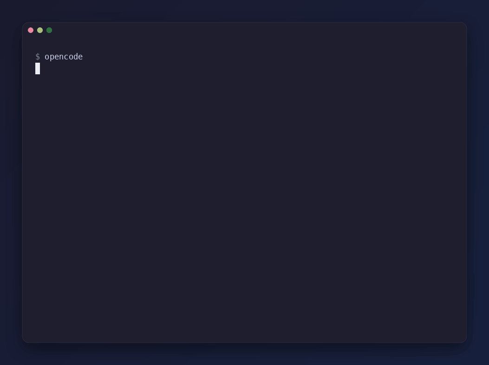
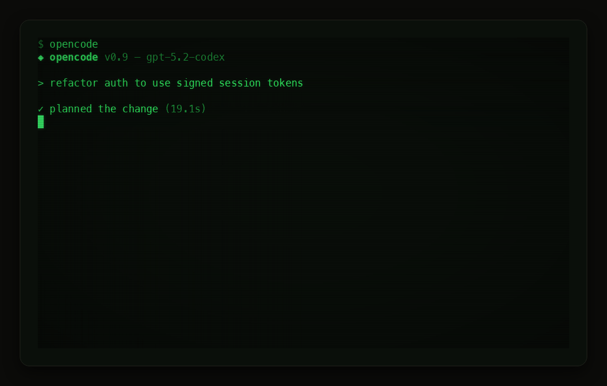

# reel

> Your terminal demo, edited like video.

Record a terminal session once, then treat it as a timeline you can cut,
speed-ramp, zoom, caption, restyle, and score with sound — re-rendering in
milliseconds without ever re-running the underlying program.



**Status:** capture, timeline editing, rendering, audio, and video (Phases
0–2 of the [spec](docs/SPEC.md), plus most of Phase 3) work end to end:
record with `reel record`, edit with a `.reel` file, render a styled GIF or
a WebM with procedurally synthesized sound. Honest benchmarks against `agg`
live in [docs/COMPARISON.md](docs/COMPARISON.md). Script mode (`type`/`key`
automation), VHS `.tape` import, and Sixel/Kitty graphics are still on the
roadmap; Windows is compiled in CI but untested.

## The pitch, in one edit

42 seconds of raw agent session…



…become 22 that tell a story — the thinking pause compressed 9×, the diff
zoomed, the tests sped up, a chime on green
([the edit file](examples/agent-demo.reel)):



And because every edit is a re-render of the frozen recording, restyling is
free — the same session on the `crt` template:



## How it works

```
session.cast ──▶ VT emulation ──▶ grid snapshots ──▶ timeline ops ──▶ rasterize ──▶ compose ──▶ encode
  (+ .reelmeta)  (alacritty_terminal)              (trim/cut/speed/   (swash +      (chrome,     (GIF, WebM,
                                                    zoom/caption/…)    glyph cache)   fx, shadow)   PNG)
                                                        │
                                                        └─▶ audio events ──▶ synthesize ──▶ mix ──▶ Opus
                                                            (keys, cues,      (recipes, no
                                                             thinking bed)     samples)
```

The hard rule: **capture and render never touch.** Once a session is
recorded, the program is never executed again. Changing the theme, font,
template, zoom, edits, or audio is a pure re-render — no LLM re-runs, no
flaky re-recordings.

## Install

```sh
curl -fsSL https://raw.githubusercontent.com/galfrevn/reel/main/setup.sh | bash
```

Grabs a prebuilt binary when one exists for your platform, otherwise builds
from source with cargo. (`reel.sh/setup.sh` will point here once the domain
is live.)

## Quick start

```sh
# Record with reel's own capture (asciinema .cast files work too)
reel record -o session.cast -- your-tui

# Instant render with default styling
reel render session.cast

# Or scaffold an edit file and shape the timeline
reel init glass
reel render demo.reel
```

A `.reel` file is TOML front-matter plus a newline-delimited edit script:

```
---
[source]
cast = "session.cast"

[template]
name = "glass"

[output]
file   = "demo.webm"
budget = "2mb"          # the encoder degrades predictably to fit

[audio]
keyboard = "mx-brown"   # procedural keystrokes from the recorded input
---

trim    2s..end
cut     19s..23s                  # remove the typo
speed   5x from 8s to 34s         # compress the model's thinking pause
caption "Refactor the auth module" at 4s for 2.5s
zoom    1.8x at (30,10) from 36s to 41s
sound   "success" at 41s
freeze  last 1.5s
```

All timestamps refer to the **recording's own clock** (source time), so edits
stay valid as you add or remove other edits. Bare durations (`for 2.5s`,
`freeze last 1.5s`) are output time — what the viewer experiences.

## Commands

```
reel record -o FILE -- CMD     # capture over a PTY (+ .reelmeta input sidecar)
reel render FILE               # .reel or .cast → .gif / .webm / .png / .txt
reel watch FILE                # re-render on save; --serve for live browser preview
reel shot FILE --at T          # single frame PNG
reel inspect FILE              # timeline summary
reel init [template]           # scaffold a .reel file
reel template list|show|add    # templates, incl. installing packs from GitHub
reel theme list|import         # themes, incl. base16 / Alacritty / iTerm2 import
```

## Sound without audio files

WebM output carries Opus audio synthesized entirely from *recipes* — tone and
filtered-noise layers with envelopes and a shimmer tail (a model borrowed
from [cuelume](https://github.com/Danilaa1/cuelume), MIT). No samples, no
audio files, byte-identical output everywhere:

- **Keyboard**: press/release pairs per recorded keystroke, humanized ±3%
  pitch / ±15% gain, with profiles (`mx-brown`, `mx-blue`, `topre`, `laptop`,
  `typewriter`, `none`) and distinct enter/space/backspace voicing
- **UI cues**: the grid diff already knows when the screen answers — a
  subtle pop, zero configuration
- **Thinking bed**: long idle stretches get a low breathing pulse that
  resolves to a chime when output resumes — exactly the region you're
  speed-ramping
- Audio is an **event list**, mixed after the timeline resolves: `speed 5x`
  drops keystrokes instead of chipmunking them, `cut` deletes their sounds,
  `mute`/`volume` shape regions

Demos must work muted (GitHub, Twitter, LinkedIn autoplay silent) — audio is
polish, never information.

## What's here today

- `reel record`: own PTY capture with timestamped input events in a
  `.reelmeta` sidecar (what makes keystroke audio accurate)
- asciinema v2 cast parsing; full VT emulation via `alacritty_terminal`:
  alt screen, wide chars, synchronized output (`?2026`), OSC 4 overrides
- Timeline ops: `trim`, `cut`, `speed`, `hold`, `freeze`, `zoom`, `pan`,
  `caption`, `highlight`, `marker`, `sound`, `mute`, `volume`
- Templates: `minimal`, `glass`, `classic`, `geist`, `paper`, and `crt`
  (phosphor glow, scanlines, vignette) — plus your own as TOML:
  `reel template show glass > mine.toml`, edit, `reel template add mine.toml`,
  or install packs from any GitHub repo with `reel template add owner/repo`
- Theme import: base16 YAML, Alacritty TOML/YAML, iTerm2 `.itermcolors`
- System font discovery with a Nerd-Font-first preference chain and a
  lazy per-glyph fallback scan (icons, box drawing, braille, emoji resolve
  against whatever is installed). Name any installed font with
  `[style] font = "..."`. Install a Nerd Font for TUI icon glyphs; output
  is deterministic for a given set of installed fonts
- Change-driven GIF encoding: frames on grid change (not a clock), exact
  palette when content fits 256 colors, delta rectangles
- WebM: VP9 (screen-content tuned) + Opus in a deterministic in-house muxer
- Size budgets for both formats: a greedy degradation ladder that reports
  every step it takes
- Zoom re-rasterizes glyphs at the target size — text stays sharp

## Regenerate demos in CI

The repo doubles as a GitHub Action, so README demos never go stale:

```yaml
- uses: galfrevn/reel@main
  with:
    files: docs/demo.reel
    # font: JetBrainsMono   # Nerd Font installed on the runner (default);
                            # pin it so CI renders don't drift with fonts
- uses: stefanzweifel/git-auto-commit-action@v5
  with:
    commit_message: "chore: re-render demos"
```

## Let your agent do it

You don't have to learn any of the above. reel ships an [agent skill](skills/reel/SKILL.md)
so coding agents (Claude Code, Cursor, etc.) can produce the demo for you —
record once, then ask for "a README GIF under 800kb with the boring part sped
up" and the agent handles inspection, editing, and rendering. Install it with
[skills.sh](https://skills.sh):

```sh
npx skills add galfrevn/reel
```

## Building

```sh
cargo build --release   # single binary at target/release/reel
cargo test --workspace
```

Video output links libvpx at build time (`brew install libvpx` /
`apt install libvpx-dev`; releases link it statically). No libvpx handy?
`cargo build --no-default-features -p reel-cli` builds everything except
`.webm` in pure Rust — audio synthesis included.

reel renders with the fonts installed on your machine — no fonts ship in
the binary. For TUI demos, install any [Nerd Font](https://www.nerdfonts.com)
build so icon glyphs render; reel prefers one automatically when present.

## License

MIT.
